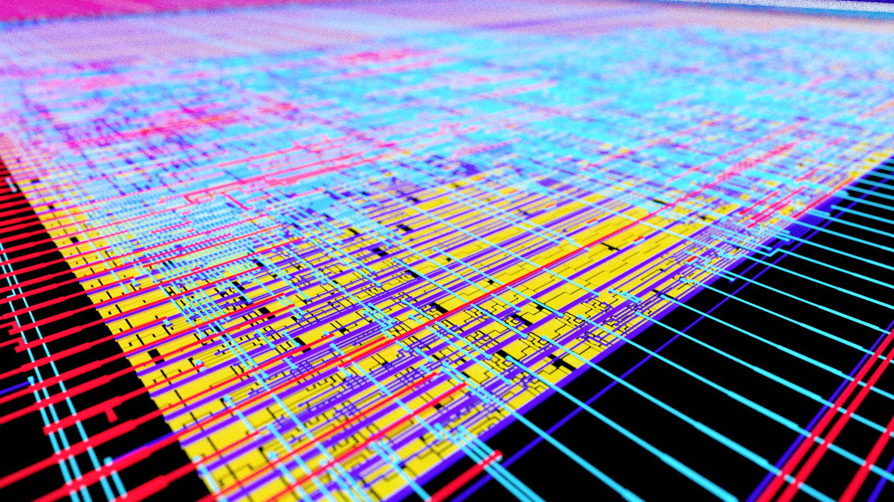
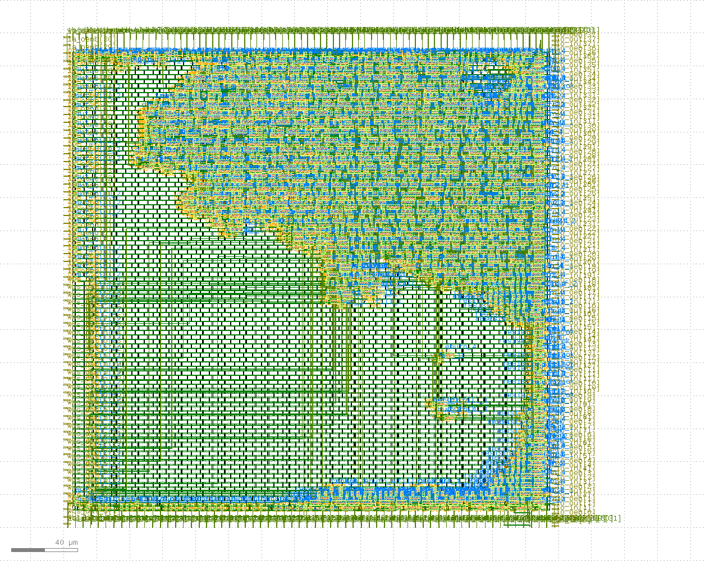

# License

This project is under Apache License 2.0.

# Purpose

To emit fibonacci numbers on io_out[37:8] on every clock (configurable).
This being 30-bit wide it effectively limits it to 44 iterations, so after
that  it restarts from the start after that. There is also WishBone operations
to send and receive data.

This is part of the [zerotoasic](https://www.zerotoasiccourse.com/) multi project submission to fit within a 300um x 300um area.

# In-action heatmap

The rendering was created using [sky130-chip-vis](https://github.com/konradwilk/sky130-chip-vis) which originally
was forked from [Anish Singhani repo](https://github.com/asinghani/sky130-chip-vis)

make visualize

creates it - and it visualizes the two test-cases (*test_wrapper* and *test_wb_logic*).

# Blender rendering

# GDS 

