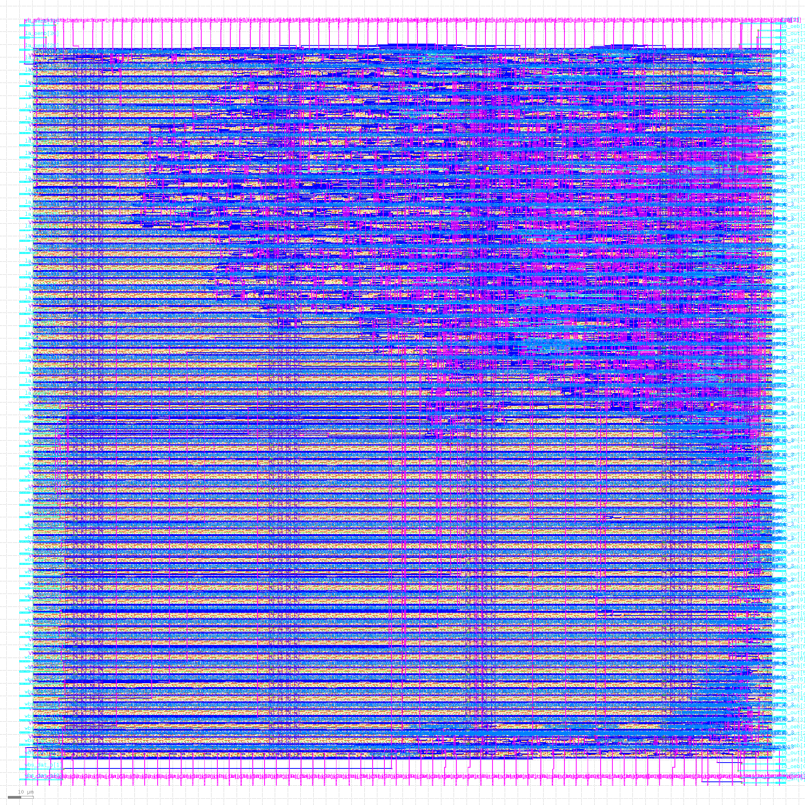

# License

This project is under Apache License 2.0.

# Purpose

To emit fibonacci numbers on value[33:0] on every clock. This being 32-bit
wide it effectively limits it to 47 iterations, so it restarts from the
beginning after that.

This is part of the [zerotoasic](https://www.zerotoasiccourse.com/) multi project submission to fit within a 300um x 300um area.

